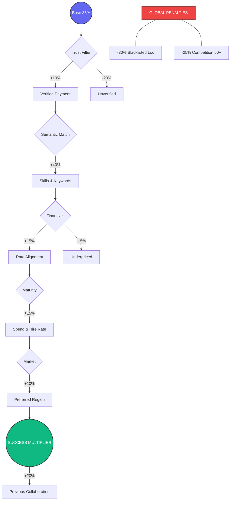

# 🧠 High-Precision Scoring Engine (MNC-Grade)

Upwork Match Intelligence (UMI) uses a multi-dimensional analysis system to surface high-alpha opportunities. It has been refined to prioritize "verified professional" indicators while filtering out low-quality leads.

## 📊 Visual Scoring Matrix

## 🔄 The Intelligence Cycle

1.  **Scrape Job Tile**: The extension scans the DOM for new job cards as you scroll.
2.  **Lazy Background Fetch**: For high-potential jobs, it lazily fetches full job details (Mandatory Skills, Interviews, Invites) in the background.
3.  **Scoring Logic**: It applies the 7 Weighting Heuristics below.
4.  **Strategic UI Inject**: Overlays the "God View" badge with high-alpha labels.

## 📐 Weighting Heuristics

### 1. The Skills Engine (+40% Max)

- **Direct Skill Overlap**: Compares your **Synced Profile Skills** against the job description.
- **Mandatory Lockdown**: Missing any skill explicitly marked "Mandatory" by the client results in a **-15% cumulative penalty** per missing skill.

### 2. The Saturation Shield (-25% Penalty)

- **0-5 Proposals**: High Alpha (First-mover advantage).
- **20-50 Proposals**: Warning Flag.
- **50+ Proposals**: Auto-degrade score by **25%** to discourage bids on over-saturated jobs.

### 3. Client Trust Matrix (+15%)

- **Payment Unverified**: Mandatory **-30%** penalty.
- **Hire Rate < 30%**: "Low Yield" warning flag.
- **Hire Rate > 75%**: "Verified Buyer" bonus (+10%).

### 4. Recency Momentum (+15% Max)

Calculated based on the `Last Viewed by Client` metric:

- **< 10 minutes**: +15% (Client is actively reviewing).
- **1-6 hours**: +10%.
- **> 24 hours**: Warning (Stale Intent).

## 🤖 AI Alpha Insights (LLM Override)

Beyond heuristic scoring, users can trigger a **Deep AI Insight**. This action passes the job's telemetry and your profile data to Gemini or GPT-4o.

**The AI provides:**

1.  **Revised Alpha Score**: Overrides the baseline with cognitive analysis of stack compatibility.
2.  **Winning Strategy**: Tactical advice on architecture risks or hidden pains found in the job text.
3.  **Pitch Hook**: High-conversion first sentences tailored to the client's specific tone.

---

_Proprietary Engineering by Upwork Match Intelligence Team._
