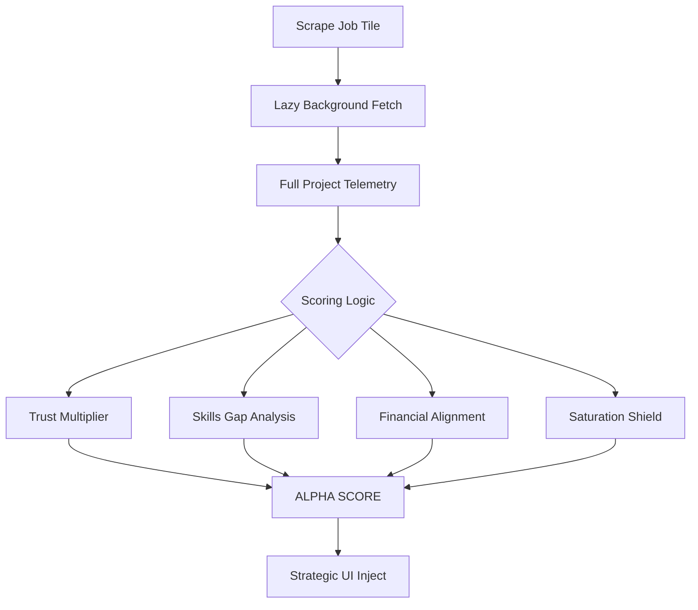

# UMI Scoring Matrix & Logic 📊

The Upwork Match Intelligence engine uses a prioritized weighting system to identify high-ROI projects.

## 🔄 The Data Pipeline

## 📐 Weighting Heuristics

### 1. The Skills Engine (+40% Max)

- **Top 10 Matches**: Weighted by frequency in job description and title.
- **Mandatory Lockdown**: Missing a mandatory skill (explicitly marked by client) results in a **-15% cumulative penalty**.

### 2. The Saturation Shield (-25% Penalty)

- **0-5 Proposals**: Alpha Multiplier (Fresh Intent).
- **20-50 Proposals**: Warning Flag.
- **50+ Proposals**: Auto-degrade score by **25%** to discourage bids on over-saturated jobs.

### 3. Client Trust Matrix

- **Payment Unverified**: Mandatory **-30%** penalty.
- **Hire Rate < 30%**: "Low Yield" warning flag.
- **Hire Rate > 75%**: "Verified Buyer" bonus (+10%).

### 4. Recency Momentum (+15% Max)

Calculated based on the `Last Viewed by Client` metric:

- **< 10 minutes**: +15% (Client is actively reviewing).
- **1-6 hours**: +10%.
- **> 24 hours**: Warning (Stale Intent).

## 💎 High-Alpha Signals

When the score exceeds your **Notification Threshold (Default: 85%)**:

1.  **AI Deep Dive Enabled**: Unlocks strategic pitch hooks.
2.  **Visual Highlight**: The job tile receives an emerald glow.
3.  **Alpha Signal Advice**: Message changes to "🔥 PRIME OPPORTUNITY".

---

_Proprietary Engineering by Upwork Match Intelligence._
