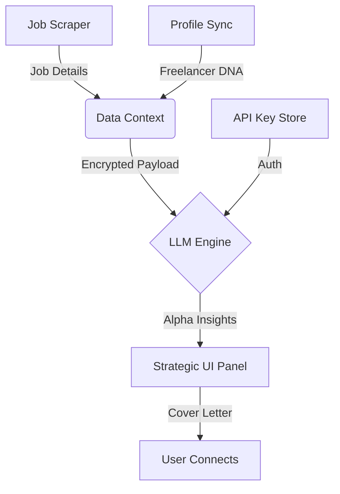

# 🧠 Cognitive Layer: AI & LLM Integration Guide

The **Upwork Match Intelligence** extension is evolving to include a cognitive layer. This guide explains how to integrate and use the AI features.

## 🤖 Supported Models

| Engine                    | Recommendation    | Best For                                         |
| :------------------------ | :---------------- | :----------------------------------------------- |
| **Google Gemini-1.5-Pro** | ⭐ High (Default) | Context-rich job analysis and creative drafting. |
| **OpenAI GPT-4o**         | High              | Precise logic and direct instruction following.  |
| **Base Engine**           | Balanced          | Fast, local heuristic scoring without API costs. |

## 🔄 Cognitive Data Flow

## ⚙️ Setup Instructions

1. **Obtain API Keys**:
   - For Gemini: [Google AI Studio](https://aistudio.google.com/).
   - For OpenAI: [OpenAI Platform](https://platform.openai.com/).
2. **Configure Popup**:
   - Open the **Match Intel** popup.
   - Scroll to **AI Intelligence (LLM Configuration)**.
   - Select your preferred model and paste your key.
3. **Usage**:
   - Once configured, the **Strategic Panel** on Upwork will begin offering "Alpha Insights"—generated summaries of why a job is a perfect match and drafting personalized intros for your cover letters.

## 🛡️ Security & Privacy

- **Local Persistence**: Your API keys are stored in `chrome.storage.sync` which is encrypted and only accessible by your Chrome instance.
- **Zero-Logging**: We do not store your profile data or API keys on external servers. All AI calls happen directly from your browser background script to the provider.
- **Cost Management**: The extension uses a "Debounced Token Strategy" to minimize API calls, ensuring jobs are only analyzed when you specifically choose to view them deeply.

## 🗺️ Roadmap: Future AI Features

- **Semantic Auto-Correction**: The AI will suggest better keywords for your "Intel Pool" based on success rates.
- **Tone-Matching**: Adjust the cover letter draft to match the client's communication style detected in their job post.
- **Multi-Model Chaining**: Use Gemini for research and GPT for final formatting.
