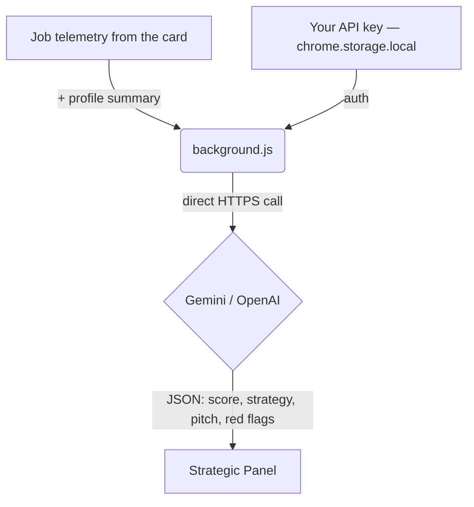

# 🧠 AI Integration Guide

The **AI Deep Dive** is an **optional** layer. UMI's heuristic scoring works fully without it and with no
API key. When you enable AI, UMI calls your chosen provider **directly from your browser**, using **your**
key — there is no UMI server in the path.

## Supported models

| Provider | Model used | Best for |
| :------- | :--------- | :------- |
| **Google Gemini** | `gemini-1.5-flash` | Fast, low-cost job analysis and drafting. |
| **OpenAI** | `gpt-4o-mini` | Precise instruction-following. |
| **Heuristics only** | — (no API) | Fully local scoring, zero API cost. |

> Model IDs are defined in `background.js` (`callGemini` / `callOpenAI`). Update them there if you want a
> different model.

## Data flow

```mermaid
graph TD
    A[Job telemetry from the card] -->|+ profile summary| B(background.js)
    K[Your API key — chrome.storage.local] -->|auth| B
    B -->|direct HTTPS call| D{Gemini / OpenAI}
    D -->|JSON: score, strategy, pitch, red flags| F[Strategic Panel]
```

## Setup

1. **Get an API key**
   - Gemini: [Google AI Studio](https://aistudio.google.com/)
   - OpenAI: [OpenAI Platform](https://platform.openai.com/)
2. **Configure the popup** — open **Match Intel** → Strategic Config → **Core Intelligence Hub**. Choose
   your model and paste your key. Click **Deploy Configurations**.
3. **Use it** — on a high-scoring job card, click the **circle/info icon** on the UMI badge. The advice
   strip shows "Consultant is analyzing…", then reveals a revised score, **Winning Strategy**,
   **Pitch Hook**, and any **red flags**.

## What the AI returns

A strict JSON object: `revisedScore`, `alphaInsight`, `winningStrategy`, `pitchHook`, and `redFlags[]`.
The prompt instructs the model to be brutally honest and to *lower* the score for time-wasters — the goal
is to save your time, not to hype every job.

## 🛡️ Privacy & cost

- **Key storage:** your API key lives in `chrome.storage.local` — **on this device only, never
  cloud-synced**, and only ever sent to the provider you selected. (Older versions stored it in synced
  storage; re-saving in the popup migrates it to local.)
- **No third-party server:** calls go browser → provider. UMI logs nothing externally.
- **On-demand only:** AI runs only when you click the Deep Dive button on a specific job — never
  automatically — so you control every token spent.
