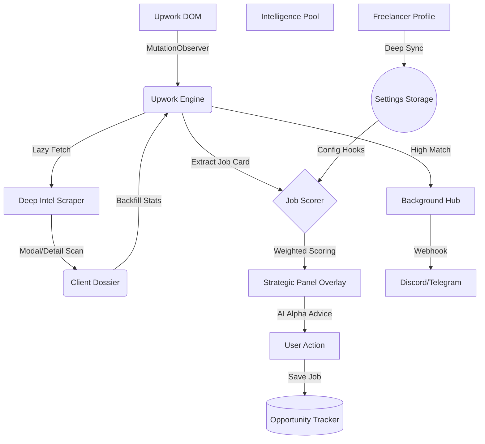

# 🏗️ MNC-Grade Architecture: Upwork Match Intelligence

Upwork Match Intelligence is a decentralized AI layer designed for high-performance lead qualification. It follows a state-of-the-art **Observability and Intelligence Engine** pattern.

## 📊 High-Level Component Architecure

## 1. 🔍 The Intelligence Engine (`content.js`)

The engine is the primary processor. It utilizes a multi-layered observation strategy to ensure zero-latency injection of strategic data.

### 💉 Injection Pipeline

1. **DOM Hooking**: `MutationObserver` detects new job tiles.
2. **First-Pass Extraction**: Scrapes immediate data (Title, Budget, Hire Rate).
3. **Lazy Enrichment**: Checks `chrome.storage.local` for "Gold Intelligence" (Activity stats, Client names) cached from previous modal opens.
4. **UI Injection**: Calculates score and advice, then transforms the job card with a **Strategic Panel**.

## 2. 🌀 The Scoring Core (`JobScorer`)

Implements a weighted decision matrix with the following intelligence vectors:

| Vector                | Weight      | Logic                                                           |
| :-------------------- | :---------- | :-------------------------------------------------------------- |
| **Trust Filter**      | -20% / +10% | Penalizes unverified payments; rewards verification.            |
| **Semantic Match**    | +40% Max    | NLP-based overlap between Profile Keywords and Job Description. |
| **Price Alignment**   | +15% Max    | Compares job rates against User's economic floor.               |
| **Client Conversion** | +15% Max    | Scores hire rates and historical USD spend.                     |
| **Market Context**    | +10% Max    | Geographic matching with preferred markets.                     |

## 3. ⚡ Profile Synchronization (Intel Pool)

The engine treats the freelancer's profile as the **Semantic Source of Truth**.

- **Adaptive Selectors**: Supports both modern Nuxt-based and legacy Upwork layouts.
- **Skill Extraction**: Automatically parses skills from the profile title, bio, and skill tags to build the matching pool.

## 4. 🛰️ The Background Automation Hub (`background.js`)

Acts as an asynchronous bridge for long-running processes:

- **Proxy Fetching**: Fetches job detail pages in the background to extract names and activity without disrupting the user.
- **Remote Webhooks**: Delivers high-alpha alerts to external platforms.
- **Cross-Tab State**: Ensures settings and intelligence are consistent across all open Upwork tabs.

## 🛠️ Performance Architecture

- **Debounced Processing**: Cycle runs are debounced (600ms) to prevent CPU spikes.
- **Lazy Loading**: Intelligence is fetched only when a job tile enters the viewport or a modal is opened.
- **Resilient Context**: Uses heartbeat checks to handle extension reloads gracefully.
