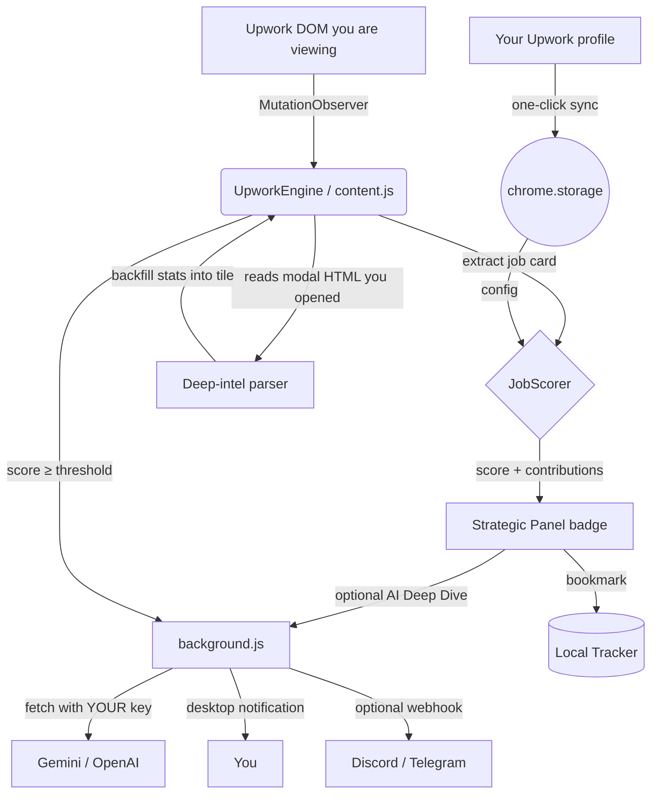

# 🏗️ Architecture: Upwork Match Intelligence

UMI is a Chrome **Manifest V3** extension with three cooperating parts — a content script (the engine), a
background service worker, and a popup. It reads only the page you are actively viewing; it has **no
backend and performs no background page fetching**.

## High-level flow

```mermaid
graph TD
    A[Upwork DOM you are viewing] -->|MutationObserver| B(UpworkEngine / content.js)
    B -->|extract job card| C{JobScorer}
    B -->|reads modal HTML you opened| D[Deep-intel parser]
    D -->|backfill stats into tile| B
    C -->|score + contributions| H[Strategic Panel badge]
    H -->|optional AI Deep Dive| K[background.js]
    K -->|fetch with YOUR key| L[Gemini / OpenAI]
    H -->|bookmark| J[(Local Tracker)]
    B -->|score ≥ threshold| K
    K -->|desktop notification| U[You]
    K -->|optional webhook| W[Discord / Telegram]
    P[Your Upwork profile] -->|one-click sync| G((chrome.storage))
    G -->|config| C
```

## 1. The Engine (`content/content.js`)

The engine reacts to the page — it never polls or auto-refreshes.

1. **DOM hooking** — a `MutationObserver` (debounced 600 ms) detects new job tiles as you scroll.
2. **Extraction** — `extractJobData()` reads what's rendered on each tile (title, budget/rate, payment
   status, hire rate, skills, proposals).
3. **Enrichment (only what you open)** — when you open a job's detail modal, `scrapeModalIfOpen()` parses
   that already-rendered HTML for activity (interviews, invites, last viewed) and mandatory skills, then
   caches it in `chrome.storage.local` and backfills the matching tile. **No detail pages are fetched in
   the background.**
4. **Scoring & injection** — `JobScorer.calculateScore()` returns a score plus a `contributions[]` array;
   `injectBadge()` renders the Strategic Panel, the "Why this score?" breakdown, and the Connect-waster
   warning.

## 2. The Scoring Core (`JobScorer`)

A transparent additive model. Every signal that moves the score also pushes a
`{ label, delta, reason }` entry, so the UI can show an honest breakdown instead of a black box. See
[SCORING_LOGIC.md](SCORING_LOGIC.md) for the full table. Scores are clamped to 0–100.

## 3. The Service Worker (`background.js`)

A thin asynchronous bridge. It does **not** fetch Upwork pages. It handles:

- **Notifications** — receives `NOTIFY_HIGH_MATCH` and shows a desktop alert (click to open the job).
- **Webhooks** — optional Discord/Telegram mirror of high-match alerts (title, budget, public link).
- **AI Deep Dive** — receives `AI_GET_ALPHA_INSIGHT`, reads your API key from `chrome.storage.local`,
  and calls Gemini/OpenAI directly from the browser.

## 4. The Popup (`popup/`)

Settings + Tracker UI. Persists configuration, shows live parse hints, renders saved jobs with their
score and breakdown, and offers per-job remove and a full reset.

## Storage model

| Data | Location | Why |
| :--- | :------- | :-- |
| Settings (rates, keywords, regions, threshold, webhook, AI model, profile summary) | `chrome.storage.sync` | Convenient across your devices. |
| **AI API key** | `chrome.storage.local` | Secret — never cloud-synced. |
| Saved/tracked jobs | `chrome.storage.local` | Device-local, can be large. |
| Deep-intel cache (`deepIntel`) | `chrome.storage.local` | Per-job activity you've opened. |
| Notified-jobs memory (`notifiedJobs`) | `chrome.storage.local` | De-dupes alerts across reloads; pruned after 7 days. |

Settings hot-reload: the engine listens on `chrome.storage.onChanged` and re-scores visible tiles when
settings change — no page reload needed.

## Resilience & performance

- **Debounced processing** (600 ms) avoids CPU spikes on busy feeds.
- **Context guards** — every async path checks `chrome.runtime?.id` so extension reloads fail gracefully.
- **Adaptive selectors** — multiple fallback selectors per field tolerate Upwork layout variants; profile
  sync **fails loudly** (a visible message) rather than silently saving empty data when selectors miss.
- **Non-destructive injection** — badges are prepended; Upwork's native UI is untouched.
