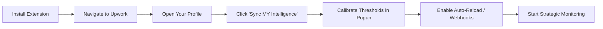

# 📄 Production & Strategic Deployment Guide

This guide ensures the **Upwork Match Intelligence** system is deployed with MNC-grade precision and reliability.

## 📦 Deployment Workflow

### 1. Installation

- Open Chrome and navigate to `chrome://extensions/`.
- Enable **Developer Mode**.
- Click **Load Unpacked** and select the extension root directory.

### 2. Semantic Calibration (Critical)

The engine is only as smart as the data it has.

- **Profile Sync**: Go to your freelancer profile page. The "Sync MY Intelligence" button will appear. Clicking this parses your entire career history into the **Intel Pool**.
- **Keyword Tuning**: Open the extension popup. Review the extracted keywords. Add any "High-Alpha" technical terms (e.g., `Generative AI`, `System Architecture`) that represent your highest-paying work.

## 🛠️ Configuration Strategy

| Strategic Setting    | Best Practice                                                                        |
| :------------------- | :----------------------------------------------------------------------------------- |
| **Alpha Threshold**  | Set to **85%** for premium filtering; **75%** for volume discovery.                  |
| **Auto-Reload**      | Set to **3-5 minutes** to ensure you are among the first 10 applicants.              |
| **Market Filtering** | Use the "Red Flag" list to block regions with historically low pay or high friction. |
| **Webhook Hub**      | Connect a Discord channel to see jobs even when you're away from your desk.          |

## 🚀 Performance Benchmarks

To maintain a premium experience, the engine adheres to these constraints:

- **DOM Stability**: Uses non-destructive injection to avoid breaking Upwork's native UI.
- **API Safety**: Does not hit Upwork APIs directly; uses human-simulated scraping to avoid detection.
- **Memory Optimization**: Auto-cleans job cache every 3 hours to maintain low memory usage.

## 🔍 Maintenance & Monitoring

- **Updates**: When Upwork changes their UI, check the `docs/architecture.md` for updated selector strategies.
- **Log Inspection**: Open the console (`F12`) on Upwork to see the `[MatchIntel]` diagnostic logs.
- **Intel Refresh**: Re-sync your profile whenever you add a new major project or skill to your Upwork profile.
