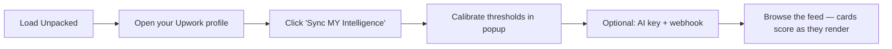

# 📄 Setup & Deployment Guide

How to install, calibrate, and get the most out of Upwork Match Intelligence (UMI).

## Deployment workflow

```mermaid
graph LR
    A[Load Unpacked] --> B[Open your Upwork profile]
    B --> C[Click 'Sync MY Intelligence']
    C --> D[Calibrate thresholds in popup]
    D --> E[Optional: AI key + webhook]
    E --> F[Browse the feed — cards score as they render]
```

## 1. Installation

- Open `chrome://extensions/` and enable **Developer Mode**.
- Click **Load Unpacked** and select the extension root directory.
- Pin the **Match Intel** icon.

## 2. Calibration (critical)

The engine is only as smart as the data it has.

- **Profile sync** — paste your public profile URL in the popup and click **Begin High-Alpha Sync**, or
  visit your profile and click **⚡ Sync MY Intelligence**. This parses your skills, title, and rate into
  the **Expertise Matrix**.
- **Keyword tuning** — open the popup and review the extracted keywords. Add high-value terms that
  represent your best-paying work (e.g. `Generative AI`, `System Architecture`). The live hint shows how
  many keywords were parsed.

## 3. Configuration strategy

| Setting | Suggested practice |
| :------ | :----------------- |
| **Notify Threshold** | 85 for premium filtering; 75 for broader discovery. |
| **Blacklisted Zones** | Block regions with historically low pay or poor fit. |
| **AI Model** | Leave on *Heuristics Only* to start; add a key only if you want Deep Dives. |
| **Webhook** | Optional: mirror high-match alerts to Discord/Telegram. |

## 4. About unattended monitoring

UMI scores jobs **only while the feed is open in your browser**. It intentionally does **not**
auto-refresh the feed or fetch jobs in the background — that would cross into the scraping/automation
Upwork's Terms prohibit. For genuine 24/7 alerts:

- Use Upwork's own **free saved-search email alerts** as your radar, and let UMI score jobs when you open
  them, **or**
- See [RADAR_ROADMAP.md](RADAR_ROADMAP.md) for the official-API backend design (not part of this
  extension).

## Behavior guarantees

- **Non-destructive injection** — UMI prepends its own panels; Upwork's native UI is untouched.
- **No direct Upwork API calls / no scraping** — UMI reads only the page you're viewing.
- **De-duplicated alerts** — a job won't re-notify on reload (7-day memory in local storage).

## Quality assurance

For step-by-step verification of every feature, see the
**[Manual Testing Guide](TESTING_GUIDE.md)**.

## Maintenance

- **Upwork UI changes** — if scores stop appearing, Upwork likely changed its markup; check selector
  strategy in [architecture.md](architecture.md) and `content/content.js`.
- **Diagnostics** — open DevTools (`F12`) on Upwork to see `[MatchIntel]` console logs.
- **Re-sync** — re-run profile sync after adding a major skill or project to your Upwork profile.
