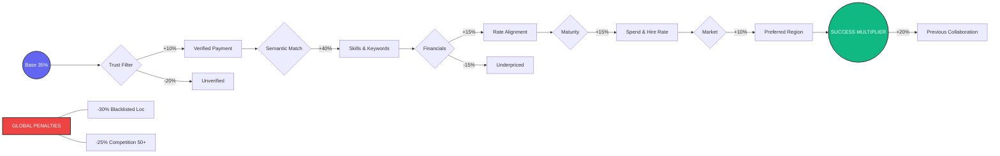
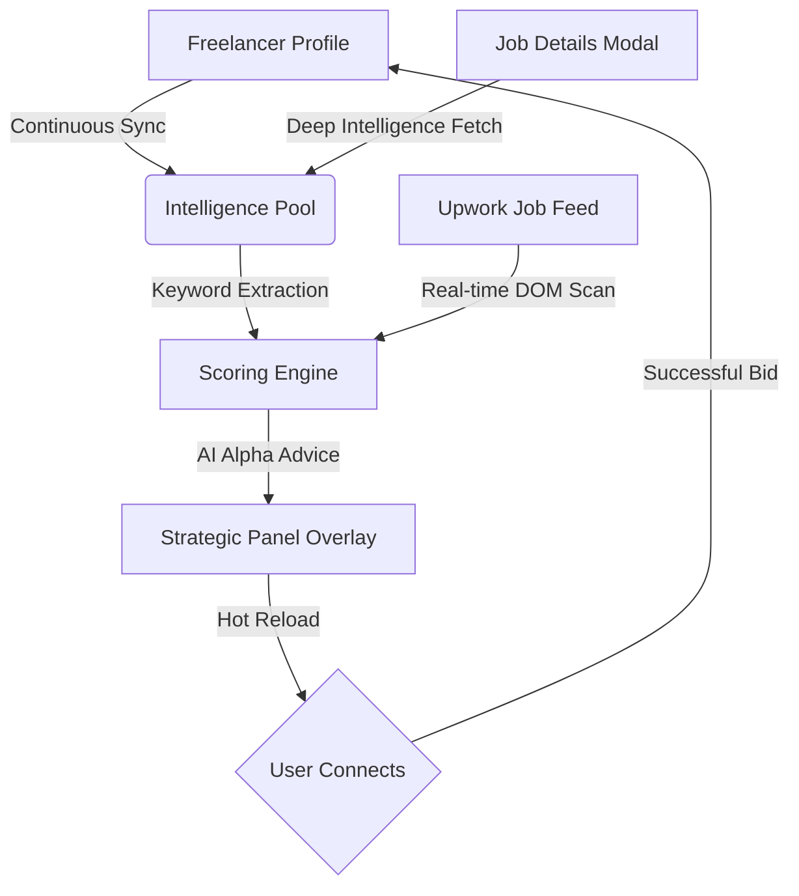

# 🧠 High-Precision Scoring Engine (MNC-Grade)

The Upwork Match Intelligence engine employs a multi-dimensional analysis system to surface high-alpha opportunities. It has been refined to prioritize "verified professional" indicators while filtering out low-quality leads.

## 📊 Visual Scoring Matrix

## 🔄 The Intelligence Cycle

## ⚖️ The Weighted Logic (Total 100%)

The algorithm starts at a **Base Confidence Score of 35%**. It then applies the following vectors:

### 1. The "Trust" Filter (Core Requirement)

- **Payment Verified**: If a client has no verified payment method, the engine applies a **-20% penalty**.
- **Verified Reward**: Verified clients receive a **+10% trust booster**.
- _Rationale_: Professionals waste no time on unverified leads. This ensures the top results are always safe.

### 2. Semantic Expertise Matching (Max +40%)

- **Multi-Vector Sync**: The engine extracts your skills from your profile and compares them against the job's tagged requirements.
- **Deep Text Mining**: It scans the title and description for keywords stored in your "Intel Pool".
- **Dynamic Ratio**: Points are awarded based on the density of matches relative to your total profile keywords.

### 3. Financial Calibration (+15%)

- **Hourly Alignment**:
  - **Within Range**: Full +15 points.
  - **Floor Met**: +10 points.
  - **Underpriced**: **-15% penalty**. If a job's max rate is below your minimum, it is de-prioritized.
- **Fixed-Price Logic**:
  - **Floor Met**: +15 points.
  - **Low Budget**: **-10% penalty** if the budget is less than 40% of your minimum threshold.

### 4. Client Maturity & Conversion (+15%)

- **Spend History**: Clients with $K or $M in spend receive a **+7% maturity bonus**.
- **Hire Rate**: High-conversion clients (>75% hire rate) receive an **+8% booster**.
- **Low Hire Alert**: Clients with <30% hire rate receive a **-10% penalty**.

### 5. Timezone & Market Context (+10%)

- Compares client location strings against your preferred markets (e.g., USA, UK, EU). Matches grant the full **+10% geographic bonus**.

### 6. Red Flags & Competition (-30% Penalty)

- **Red Flag Locations**: Locations you've specifically blacklisted (e.g., highly saturated regions) receive a flat **-30% point penalty**.
- **Over-Saturated Jobs**: Jobs with **50+ proposals** are considered extremely high competition and receive a **-25% penalty**. Jobs with 20-50 proposals receive a **-10% penalty**.

### 7. Success Multipliers (+20% Bonus)

- **Deep Context Recognition**: If the client has worked with you before (detected via client feedback scraping) or has worked with freelancers similar to you, the engine applies a **+20% Success Multiplier**.
- **The "God View" Reveal**: When you open a job modal, the engine deep-scans for the client's name and activity stats (Interviewing/Invites) and syncs this back to your main feed.

## 🔄 Deep Search Intelligence

Unlike standard tools, this engine:

1. **Reads your Profile first**: Pulls hourly rate, top skills, past job titles, and project catalog titles.
2. **Creates a "Search Intent" Pool**: Does not just look for strings, but for professional alignment.
3. **Hot-Reloads**: Updates all scores instantly as soon as you change your settings in the popup.

## 🛡️ Integrity & Safety

The engine is strictly **Read-Only**. It does not modify Upwork DOM data or interact with Upwork's internal APIs. It exists entirely as an overlay in your local browser session.
